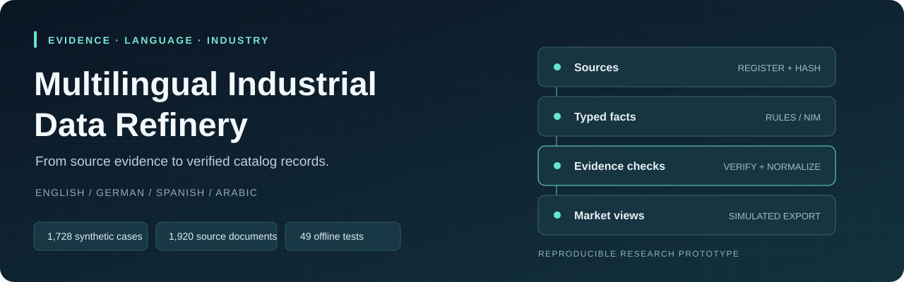
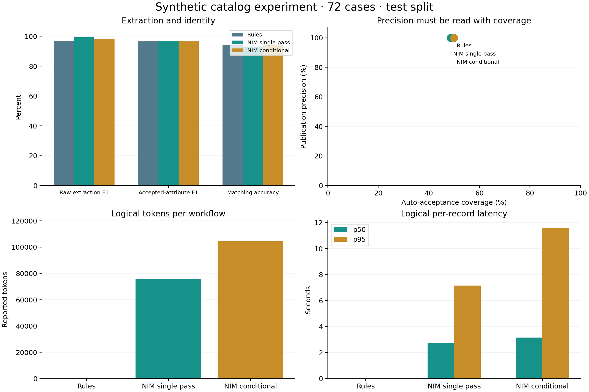

<p align="center">
  
</p>

# Multilingual Industrial Data Refinery

**Turn multilingual motor-catalog sources into evidence-linked records and market-specific views.**

[](https://github.com/MohdMuzakkiruddinAhmed/multilingual-industrial-data-refinery/actions/workflows/tests.yml)


[Quick start](#quick-start) · [How it works](#how-it-works) · [Results](#measured-results) · [Documentation](#documentation) · [Contributing](CONTRIBUTING.md)

A reproducible Python research prototype comparing deterministic extraction with
NVIDIA NIM single-pass extraction and conditional repair. Every accepted fact
retains source evidence; deterministic checks govern a **simulated publication**
step. The offline workflow needs no API key.

| Evidence | Multilingual coverage | Reproducibility |
| --- | --- | --- |
| Source hashes, exact quotes, and normalization rules | English, German, Spanish, Arabic | 1,728 synthetic cases and 1,920 source documents |
| Conflict, revision, and withdrawal checks | Five market profiles, including two Spanish markets | Frozen datasets, request audits, reports, and 49 offline tests |

> **Research scope:** synthetic industrial motor catalogs. These results do not
> establish production accuracy or general translation quality. Publication is
> a local simulation; market certificates and approval metadata are fixtures.

## Quick start

Requires **Python 3.11 or newer** and Git. Run commands from the repository root.
The core runtime uses only the Python standard library.

```bash
git clone https://github.com/MohdMuzakkiruddinAhmed/multilingual-industrial-data-refinery.git
cd multilingual-industrial-data-refinery
python -m venv .venv
```

Activate the environment for your platform:

```powershell
# Windows PowerShell
.venv\Scripts\Activate.ps1
```

```bash
# macOS / Linux
source .venv/bin/activate
```

Install, test, and run the original 14-case demo:

```bash
python -m pip install -e .
python -m unittest discover -s tests -v
python -m refinery run --provider rules --out outputs/local-demo
```

The demo writes `run.json`, `publications.json`, and an HTML review dashboard to
`outputs/local-demo/`. The reference outcome is **14/14 exact cases**, with eight
approved records and six requiring review. No model requests are made.

Install `python -m pip install -e ".[plots]"` if you want to regenerate comparison
figures with Matplotlib. This is optional for the core workflow and tests.

## Explore the reports

The saved experiment can be explored immediately after cloning. From the
repository root, run:

```bash
python -m http.server 8000 --bind 127.0.0.1
```

- [Paired experiment dashboard](http://127.0.0.1:8000/outputs/experiments/test-paired-nim/report.html)
- [Your local demo dashboard](http://127.0.0.1:8000/outputs/local-demo/report.html) — after running the demo
- [Saved results in Markdown](outputs/experiments/test-paired-nim/RESULTS.md) — readable directly on GitHub

The local links work while the server is running; press `Ctrl+C` to stop it.
GitHub displays HTML files as source, so use the Markdown report when browsing
the repository without a local server.

## How it works

1. **Register sources.** Track source hashes, authorization, active revisions,
   and supersession. Raw benchmark files are verified during ingestion.
2. **Propose facts.** Rules or NIM produce typed attribute proposals with source
   identifiers and verbatim evidence quotes.
3. **Check the evidence.** Deterministic validation checks complete text spans,
   values, units, source eligibility, conflicts, and omissions. Conditional NIM
   can make one extraction-repair attempt.
4. **Build the record and view.** Match product identity, preserve technical
   values, and render controlled terminology for the target market.
5. **Gate the export.** Recheck accepted facts and market requirements before
   simulated publication; unresolved records require review. Model review is
   advisory and cannot approve publication.

Expected answers remain separate from inference. See the
[architecture guide](docs/ARCHITECTURE.md) for modules and data boundaries.

## Measured results

The v2 dataset contains **1,728 cases**, **1,920 source documents**, **24 product
families**, **four languages**, and **18 scenarios**. Product families are disjoint
across train/development/test splits. The full offline test covers 432 cases; the
paired live comparison covers the same 72 held-out cases in every workflow.

| Workflow | Exact cases | Accepted-attribute F1 | Auto-acceptance | Logical API calls |
| --- | ---: | ---: | ---: | ---: |
| Rules | 68/72 | 96.67% | 50.0% | 0 |
| NIM single pass | 67/72 | 96.52% | 48.61% | 66 |
| NIM conditional repair | 68/72 | 96.67% | 50.0% | 103 |

All three workflows had zero unsafe publication decisions and zero unsupported
accepted facts on these cases. Conditional repair recovered one record at the
cost of 37 additional calls. Narrative evidence verification remains the main
coverage limitation. These synthetic results do not establish production accuracy.

Read [the interpretation](EXPERIMENT_RESULTS.md),
[the full generated report](outputs/experiments/test-paired-nim/RESULTS.md), or
[the metric JSON](outputs/experiments/test-paired-nim/summary.json).



## Reproduce the experiment

```bash
# Entire deterministic test split, with a new output directory.
python -m refinery.experiments run --split test --per-stratum 0 --out outputs/my-rules-run

# Requires NVIDIA_API_KEY in this process environment.
python -m refinery.experiments run --split test --live --max-calls 180 --timeout 20 --out outputs/my-nim-run
```

The default live model is `nvidia/nemotron-3-super-120b-a12b`. Both NIM workflows
share the first model response; additional repair/review calls remain live.
Hosted inference sends the synthetic documents to NVIDIA. There is no implicit
provider fallback. Saved request errors remain included in the experiment.

Set a key with a hidden PowerShell prompt:

```powershell
$nimSecret = Read-Host 'NVIDIA API key' -AsSecureString
$env:NVIDIA_API_KEY = [System.Net.NetworkCredential]::new('', $nimSecret).Password
try {
    python -m refinery.experiments run --split test --live --out outputs/my-live-run
} finally {
    Remove-Item Env:NVIDIA_API_KEY
    Remove-Variable nimSecret
}
```

`.env.example` documents configuration names; the application reads environment
variables and does not automatically load `.env` files. No real key is included.

## Documentation

| Guide | What you will find |
| --- | --- |
| [Architecture](docs/ARCHITECTURE.md) | Data flow, module map, and evidence boundaries |
| [Experiment protocol](EXPERIMENTS.md) | Dataset splits, reproduction commands, and metric definitions |
| [Results and limitations](EXPERIMENT_RESULTS.md) | Interpretation of the paired study and full deterministic run |
| [Dataset index](data/README.md) | Canonical benchmark, raw documents, and earlier fixtures |
| [Saved-run index](outputs/README.md) | Dashboards, model audits, and historical diagnostics |
| [Original PoC guide](POC_GUIDE.md) | Detailed walkthrough of the initial implementation |
| [Contributing](CONTRIBUTING.md) | Local checks and research-artifact conventions |
| [Package integrity](PACKAGE_CONTENTS.md) | File inventory and checksum verification |

## Repository layout

```text
refinery/                    Extraction, validation, NIM client, evaluation, reports
tests/                       Offline regression and adversarial tests
data/
  sources.json               Original 14-case fixtures
  expected.json              Separate original oracle
  benchmark-v2-final/        Canonical 1,728-case benchmark and raw documents
  benchmark-v2/              Preserved preflight generator artifact
outputs/
  experiments/
    test-paired-nim/         Main paired comparison: 72 held-out cases
    test-rules-full/         Full rules evaluation: 432 held-out cases
    dev-rules/               Development baseline
    dev-nim-smoke/           Development API smoke test
  ...                        Earlier PoC runs and diagnostics
docs/                        Architecture and presentation assets
.github/                     Offline CI, issue forms, and pull request template
```

New experiment folders are ignored by Git by default. Use a fresh output folder
for each run and preserve the bundled datasets and historical results.
`PLAN.md`, `draft.txt`, and `TEST_RESULTS.md` retain the original planning and
early verification context; the final study is described in
[EXPERIMENT_RESULTS.md](EXPERIMENT_RESULTS.md).

## Contributing and reuse

Bug reports and reproducible improvements are welcome. Start with
[CONTRIBUTING.md](CONTRIBUTING.md), run the offline checks, and include the affected
case or scenario in your report.

No open-source license has been selected for this repository. A license grant
is not included in this publication.
